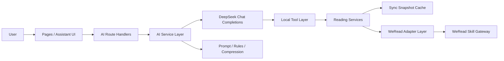

# WeReadAura AI 能力方案

## 1. 文档信息

- 项目名称：`WeReadAura`
- 文档版本：`v0.1`
- 文档状态：方案草案
- 编写日期：`2026-05-19`
- 适用阶段：`MVP 方案设计，暂不编码`
- 关联文档：
  - [docs/weread-reading-analytics-prd.md](D:\WeReadAura\docs\weread-reading-analytics-prd.md)
  - [docs/technical-architecture.md](D:\WeReadAura\docs\technical-architecture.md)
  - [docs/frontend-visual-style-guide.md](D:\WeReadAura\docs\frontend-visual-style-guide.md)
  - [AGENTS.md](D:\WeReadAura\AGENTS.md)

## 2. 目标与定位

本方案定义 WeReadAura 中“AI 能力层”的接入边界、技术路线、模块拆分与操作步骤。

AI 在本项目中的目标不是只做聊天助手，而是围绕“个人阅读分析”提供两类能力：

- 对话式能力：用户通过自然语言提问，获得书架、统计、笔记、推荐相关回答
- 页面式能力：在首页、统计页、发现页或未来阶段性总结视图中生成阅读人格、偏好、行为、阶段总结等分析模块

AI 能力层的目标是帮助用户：

- 理解当前书架、统计、划线、推荐数据
- 用自然语言发起查询，而不是只靠页面筛选器
- 基于当前同步快照生成解释、总结、画像和复盘建议
- 把结构化阅读数据转成适合界面展示的洞察卡片与阶段报告
- 在数据不完整时给出明确提示，而不是编造答案

当前阶段仅规划只读分析能力，不引入写回、代操作、公开分享和自动执行同步。

## 3. 与现有仓库的关系

当前仓库已经不是纯文档状态，而是具备可运行的 Next.js 单仓全栈骨架，并已有以下基础能力：

- `src/app/api/*`：内部 BFF Route Handlers
- `src/server/services/*`：阅读数据聚合与页面服务层
- `src/server/adapters/weread/*`：微信读书 Skill 适配层
- `src/server/cache/sync-cache.ts`：当前同步快照缓存
- `src/app/settings` 与 `src/app/api/settings/route.ts`：服务端保存密钥的现有模式

因此 AI 助手不应新开第二套后端服务，也不应让浏览器直接访问 DeepSeek API。首版应沿用现有分层，在当前 Next.js BFF 体系内完成接入。

## 4. AI 能力范围

### 4.1 当前范围

- 接入 DeepSeek API 作为模型推理层
- 提供前端聊天入口
- 通过服务端工具读取当前阅读分析数据
- 支持总览、统计、书架、单书、笔记、推荐等问答场景
- 支持页面内 AI 分析卡片与报告模块
- 支持生成阅读人格、阅读偏好、阅读行为等解释性文案
- 支持生成阶段性阅读总结，如近 7 天、本月、本年、累计等周期总结
- 明确数据来源、时间范围、同步状态和降级提示

### 4.2 当前非目标

- 不做浏览器直连模型
- 不做模型直连微信读书 Skill
- 不做自动同步或后台定时任务
- 不做外部知识库、向量库和长期记忆
- 不做多智能体协作
- 不做写回微信读书、书架管理或公开分享
- 不把“人格”“偏好”“行为”做成无法复算的黑箱结论

## 5. AI 产品形态

AI 能力层包含两种产品形态，应统一由同一套服务端能力支撑。

### 5.1 对话式 AI 助手

适用场景：

- “我这个月读得怎么样”
- “最近哪几本书我投入最多”
- “我是不是更偏好历史类”
- “帮我总结最近一个月留下的笔记主题”

主要特征：

- 用户主动提问
- 模型按需调用工具
- 结果以自然语言回答为主

### 5.2 页面内 AI 分析模块

适用场景：

- 首页“你的阅读人格”卡片
- 统计页“阅读行为画像”模块
- 发现页“推荐为什么适合你”解释区
- 单书页“这本书对你来说意味着什么”简报
- 阶段性阅读总结模块

主要特征：

- 页面主动展示
- 服务端预计算或按需生成
- 输出结果是结构化 DTO，而不是自由聊天文本

两者的关系如下：

- 对话式 AI 解决“临时提问”
- 页面式 AI 解决“稳定展示”
- 两者复用同一套事实层、规则层和提示词资产

## 6. 核心架构结论

首版 AI 能力层采用以下路线：

`页面 / 聊天 UI -> Next.js Route Handler -> AI Service -> DeepSeek Chat API -> 本地工具层 -> 现有阅读服务层 / 同步快照`



该架构的关键原则如下：

- DeepSeek 负责理解和表达，不直接负责事实计算
- 事实数据优先来自本地服务层与同步快照
- 微信读书 Skill 继续只是数据源，不直接暴露给前端 AI
- 统计口径仍由服务层统一定义，避免模型自行推断
- 页面内分析与聊天分析共享同一套事实与规则
- 页面展示优先消费结构化 AI 输出，而不是直接渲染自由文本块

## 7. AI 能力矩阵

建议将 AI 能力拆成四类，而不是只定义成“助手”。

### 7.1 解释型能力

面向已有指标做说明，例如：

- 为什么最近阅读时长下降
- 为什么推荐结果偏向某些类别
- 为什么某本书虽然没读完但投入很高

输出形式：

- 对话回答
- 洞察文案
- 卡片副标题

### 7.2 画像型能力

面向用户长期或阶段性行为给出标签化总结，例如：

- 阅读人格
- 阅读偏好
- 阅读行为风格
- 输入与产出平衡倾向

输出形式：

- 人格卡片
- 偏好标签
- 行为描述块

注意：

- 画像必须可解释
- 每个结论都应能映射到具体指标或样本
- 禁止制造“神秘但无法验证”的人格标签

### 7.3 总结型能力

面向周期性复盘，例如：

- 最近 7 天总结
- 月度阅读摘要
- 本年阶段总结
- 单书阅读总结

输出形式：

- 总结段落
- 结构化报告模块
- 海报文案素材

### 7.4 建议型能力

面向轻量建议而非自动执行，例如：

- 推荐接下来可优先读的书
- 建议回顾哪些高价值笔记
- 建议哪些书值得重读

输出形式：

- 推荐解释
- 下一步行动建议
- “值得回看”列表说明

## 8. 这个 AI 应用实际使用的技术

本项目中的 AI 助手不是单一技术，而是多层能力组合。

### 8.1 大模型推理

使用 `DeepSeek Chat Completions` 完成：

- 用户意图理解
- 问题改写与补充上下文
- 回答组织
- 总结、解释与复盘表达

模型不负责直接访问数据库或外部网关，而是通过工具拿事实。

### 8.2 Function Calling / Tool Use

这将是首版最关键的 AI 技术。

模型在需要事实数据时，不直接猜测，而是调用本地定义的工具，例如：

- `get_data_source_info`
- `get_dashboard_summary`
- `get_stats_by_period`
- `list_bookshelf`
- `get_book_detail`
- `search_notes`
- `get_recommendations`
- `search_store_books`

本质上是“LLM + Tool Use”的垂直助手形态，而不是纯 prompt 聊天机器人。

### 8.3 Skill 接入

仓库已经具备本地微信读书 Skill 能力与适配层。

在本方案中，`Skill` 的角色是：

- 作为项目的数据来源
- 由 `src/server/adapters/weread/*` 统一调用和隔离
- 不直接交给模型原生调用

因此这里用到了 Skill，但形式是：

`WeRead Skill -> 项目适配层 -> 项目工具层 -> DeepSeek`

而不是：

`DeepSeek -> 直接调用微信读书 Skill`

### 8.4 结构化检索增强

本应用具备明显的“RAG 思想”，但不是经典向量 RAG。

它更准确地属于：

- `tool-based retrieval`
- `snapshot-grounded generation`
- `structured data grounding`

其检索源不是分块文档和向量库，而是：

- 当前同步快照
- 已标准化的书架数据
- 聚合后的统计结果
- 笔记与划线列表
- 单书详情服务

因此可以说它有“检索增强生成”的能力，但不是当前主流意义上的“向量数据库 RAG”。

### 8.5 Prompt Engineering 与 Guardrails

AI 助手需要严格的系统提示词和应用层约束，用于控制：

- 回答边界
- 数据来源标注
- 时间范围表达
- 单位表达
- 缺失数据时的降级话术
- 禁止编造结论

这部分对阅读分析产品尤其重要，因为数据正确性优先级高于文案流畅度。

### 8.6 领域规则与确定性计算

本项目已有大量统计口径与业务规则，这些逻辑不应交给模型自由发挥。

应保持以下分工：

- 服务层负责统计计算、聚合和口径统一
- 模型负责解释、概括和交互

这意味着该 AI 应用其实是“模型表达 + 确定性业务逻辑”的组合，而不是让模型端到端决定一切。

### 8.7 上下文压缩与上下文选择

这是本项目非常关键的工程技巧，尤其对页面式 AI 分析更重要。

原则不是“把所有数据都喂给模型”，而是“只给当前任务真正需要的上下文”。

核心做法：

- 先识别任务类型，再决定取哪些字段
- 优先传结构化摘要，不直接传原始全量记录
- 长列表先做筛选、聚合、截断和排序
- 高亮 / 笔记正文只传与当前问题有关的少量样本
- 对阶段性总结优先传周期聚合结果，而不是全量原始事件

示例：

- 用户问“我这个月更偏好什么类型”
  - 应传：本月分类分布、作者分布、阅读时段、阅读时长趋势
  - 不应传：所有划线全文、全书架完整元数据
- 生成“阅读人格”卡片
  - 应传：近 90 天或全年关键指标、偏好分类、完成率、笔记密度、阅读时段特征
  - 不应传：逐条笔记正文
- 生成“最近笔记主题总结”
  - 应传：相关时间范围内的高价值笔记摘要样本
  - 不应传：无关时间段书架列表

建议采用三层上下文策略：

- `L1 指标层`
  - 已聚合统计、分布、排序结果
- `L2 样本层`
  - 为支撑解释而抽样的少量书籍、笔记、划线
- `L3 原始层`
  - 仅在确有必要时读取的原始明细

默认优先级应为：

`L1 > L2 > L3`

### 8.8 结构化输出

对页面内 AI 模块，建议要求模型输出结构化 JSON，而不是只返回自由文本。

例如“阅读人格卡片”建议输出：

- `title`
- `label`
- `summary`
- `evidence`
- `confidence`
- `disclaimer`

例如“阶段性总结”建议输出：

- `headline`
- `subheadline`
- `key_moments`
- `reading_patterns`
- `books_to_remember`
- `notes_theme_summary`
- `closing_message`

这样做的价值是：

- 前端更稳定
- 便于测试
- 便于审查是否越界或编造
- 更适合做卡片和报告排版

## 9. 当前不建议引入的 AI 技术

MVP 阶段不建议引入以下技术：

- 向量数据库
- Embedding 建库与语义召回
- 文档 chunking / rerank
- 模型微调
- 多智能体编排
- 长期记忆图谱
- 自动规划复杂任务链

原因如下：

- 当前数据源高度结构化
- 问答范围明确且较窄
- 现有服务层已能提供稳定事实
- 引入上述能力会显著增加复杂度，但短期收益有限

## 10. 数据与上下文来源

AI 助手允许使用的上下文来源应限定为：

- 当前连接状态
- 当前同步快照
- 当前服务层聚合结果
- 当前页面上下文中的书籍或筛选条件

不应允许以下来源直接进入模型事实层：

- 未清洗的原始上游 payload
- 未经过口径定义的中间统计值
- 浏览器本地拼装的临时字段
- 前端页面组件内部推导出的隐式业务逻辑

## 11. 页面式 AI 分析模块建议

建议将页面式 AI 能力拆成几个明确模块，而不是混成一块“智能文案”。

### 11.1 阅读人格

目标：

- 用一个短标签和一段说明总结用户阶段性阅读风格

建议输入：

- 周期内阅读总时长
- 完成册数
- 阅读分类分布
- 阅读时段分布
- 笔记与划线密度
- 在读与读完比例

建议输出：

- 人格标题
- 一句话解释
- 2 到 3 条证据
- 明确提示“这是基于当前阶段数据的归纳，不是稳定心理测评”

### 11.2 阅读偏好

目标：

- 解释用户更偏向哪些主题、作者、出版社、时段或阅读方式

建议输入：

- 分类分布
- 偏好作者
- 偏好出版社
- 阅读时段
- 阅读 / 听书占比

建议输出：

- 偏好标签列表
- 每个标签的解释
- 近周期变化说明

### 11.3 阅读行为

目标：

- 描述用户的阅读节奏、持续性、波动性和产出特征

建议输入：

- 周期阅读趋势
- 活跃日
- 连续阅读情况
- 单本书投入时长
- 划线与笔记密度

建议输出：

- 行为模式标题
- 阅读节奏摘要
- 产出强弱说明
- 可能的风险提示，例如“读得多但留下较少记录”

### 11.4 阶段总结

目标：

- 为近 7 天、本月、本年等阶段性总结提供可复盘的 narrative

建议输入：

- 周期核心指标
- 趋势变化
- 代表性书籍
- 代表性笔记样本
- 推荐互动结果

建议输出：

- 总标题
- 本周期关键词
- 3 到 5 条核心结论
- 值得记住的书
- 值得回顾的摘录主题

### 11.5 阶段性阅读总结视图

目标：

- 形成比普通统计页更强叙事感的阶段性总结视图

建议输入：

- 当前周期总阅读时长、活跃天数、完成册数
- 当前周期趋势分段
- 高投入图书
- 高产出图书
- 偏好主题变化
- 代表性笔记主题

建议输出：

- 周期 headline
- 周期阅读画像
- 周期关键词
- 最值得记住的几本书
- 当前周期阅读变化总结
- 收尾文案

## 12. 推荐模块拆分

建议在当前仓库中新增以下逻辑分层：

```text
src/
  app/
    api/
      assistant/
        chat/
          route.ts
      insights/
        route.ts
      reports/
        period/
          route.ts
  components/
    features/
      assistant/
        AssistantPanel.tsx
        AssistantMessageList.tsx
        AssistantComposer.tsx
      insights/
        ReadingPersonaCard.tsx
        ReadingPreferenceCard.tsx
        ReadingBehaviorCard.tsx
        PeriodSummaryCard.tsx
      reports/
        PeriodReportView.tsx
  lib/
    assistant-types.ts
  server/
    adapters/
      ai/
        deepseek-client.ts
        deepseek-types.ts
    services/
      assistant/
        assistant-service.ts
        assistant-tools.ts
        assistant-prompts.ts
        assistant-guards.ts
      insights/
        insight-service.ts
        insight-prompts.ts
        insight-compression.ts
        insight-evidence.ts
      reports/
        period-report-service.ts
```

各层职责如下：

- `deepseek-client.ts`：统一封装 DeepSeek API 调用
- `assistant-tools.ts`：定义模型可调用的本地工具
- `assistant-service.ts`：编排对话、工具调用与最终回答
- `assistant-prompts.ts`：集中管理系统提示词
- `assistant-guards.ts`：处理越权、缺数据、同步状态和错误降级
- `AssistantPanel.tsx`：前端聊天抽屉或侧边面板
- `insight-service.ts`：为页面内 AI 分析卡片生成结构化结果
- `insight-compression.ts`：负责按任务裁剪上下文
- `insight-evidence.ts`：把支撑结论的证据统一格式化
- `period-report-service.ts`：生成阶段性总结视图所需结构化内容

## 13. 工具设计建议

首版只开放有限、可解释、只读的工具集合。

### 13.1 建议开放的工具

- `get_data_source_info`
  - 作用：返回当前是否已连接、是否已同步、数据来源和最近同步时间
- `get_dashboard_summary`
  - 作用：返回首页核心指标、趋势、推荐摘要
- `get_stats_by_period`
  - 作用：按 `weekly / monthly / annually / overall` 获取统计结果
- `list_bookshelf`
  - 作用：根据关键词、状态、排序返回书架结果
- `get_book_detail`
  - 作用：返回单书详情、进度、划线和热门划线
- `search_notes`
  - 作用：在当前高亮与笔记中按关键词和书籍过滤
- `get_recommendations`
  - 作用：返回推荐书单及推荐理由
- `search_store_books`
  - 作用：搜索书城，并标注是否已在书架

页面式 AI 分析可额外使用以下内部工具：

- `get_period_insight_facts`
  - 作用：返回某周期的聚合指标、分布和候选证据
- `get_behavior_signals`
  - 作用：返回阅读行为相关信号，如稳定度、活跃分布、产出密度
- `get_note_theme_samples`
  - 作用：返回相关笔记样本的压缩版集合
- `get_period_report_facts`
  - 作用：返回阶段性总结视图所需的周期聚合结果

### 13.2 暂不开放的工具

- `run_sync`
- `save_api_key`
- `clear_api_key`
- 任意文件系统访问
- 任意外部网页检索

原因是首版需要严格控制副作用，避免助手变成“高权限代操作入口”。

## 14. 页面内 AI 模块的生成策略

页面式 AI 模块不建议在 React 组件内直接临时拼 prompt 再请求模型，而应统一由服务端生成结构化 DTO。

推荐策略如下：

- 首页 / 统计页洞察：
  - 首屏需要时服务端同步生成
  - 输出简短、稳定、可解释
- 阶段总结：
  - 可按周期切换触发生成
  - 优先依赖聚合结果
- 阶段性总结视图：
  - 可按周期切换生成
  - 允许比普通指标卡更强叙事感

为控制成本和稳定性，建议分为两种生成模式：

- `deterministic first`
  - 先由服务层生成事实和候选结论
  - 模型只负责润色与压缩表达
- `model assisted synthesis`
  - 对人格、主题、总结类内容让模型做有限归纳

推荐优先顺序：

- 阅读偏好、行为信号：尽量确定性生成
- 人格标签、总结文案：允许模型参与归纳

## 15. API 与会话流程

### 15.1 推荐 API

- `POST /api/assistant/chat`
- `GET /api/insights`
- `GET /api/reports/period`

请求体建议包含：

- 当前用户消息
- 最近少量会话历史
- 可选页面上下文，例如当前页面、当前书籍 ID、当前筛选条件

响应建议包含：

- 助手最终文本
- 本轮是否用到工具
- 工具调用摘要
- 数据来源状态
- 是否需要用户先同步

`GET /api/insights` 建议按 query 指定：

- `type=persona|preference|behavior|period-summary`
- `period=weekly|monthly|annually|overall`
- 可选 `bookId`

`GET /api/reports/period` 建议返回结构化阶段性总结 DTO。

### 15.2 单轮流程

1. 前端发送用户消息到 `/api/assistant/chat`
2. Route Handler 调用 `assistant-service`
3. `assistant-service` 组织系统提示词、历史消息和页面上下文
4. DeepSeek 判断是否需要工具
5. 若需要，则调用本地工具
6. 服务端把工具结果回填给模型
7. 模型生成最终回答
8. Route Handler 返回统一响应 DTO

### 15.3 页面式流程

1. 页面请求某个 AI 洞察接口
2. 服务端识别当前洞察类型
3. `insight-compression.ts` 裁剪出最小必要上下文
4. 服务端构建结构化 prompt
5. DeepSeek 返回结构化结果
6. 服务端做 schema 校验和降级
7. 页面渲染卡片或报告模块

## 16. 前端交互方案

首版推荐使用全局聊天抽屉或右侧面板，而不是新增独立页面。

原因如下：

- 更符合“阅读助手”而不是“AI 产品中心”的定位
- 可在任何页面上下文中随时提问
- 便于注入当前路由和当前书籍上下文

前端交互要求：

- 视觉风格遵循 plain neo-brutalism
- 提供空态、加载态、失败态
- 明确显示当前数据状态，例如“演示数据 / 已同步 / 未连接”
- 在答案中标注统计周期、单位和时间范围
- 支持 `prefers-reduced-motion`
- **助手回复**：模型输出 Markdown，由 `AssistantMarkdown` + `NeoProse` 渲染；规则见 [neo-brutalism-markdown-guide.md](./neo-brutalism-markdown-guide.md) §7 与 `assistant-markdown-rules.ts`

## 17. 密钥、权限与安全

DeepSeek API Key 应遵循与 WeRead API Key 相同的安全原则：

- 不保存在前端 localStorage
- 不暴露给浏览器
- 优先保存在服务端环境变量
- 如未来需要页面配置，也应保存在 `HTTP-only cookie` 或服务端配置层

安全边界要求：

- 不把完整笔记正文、令牌和用户标识输出到日志
- 不把原始上游 payload 直接发送给模型
- 对传给模型的上下文进行字段最小化裁剪
- 回答中避免泄露不必要的个人阅读明细
- 对页面式 AI 结果保留“证据摘要”字段，便于审查结论来源

## 18. 输出与文案规范

### 18.1 对话式助手 Markdown

聊天助手（`/api/assistant/chat`）的**最终用户可见正文**须为 Markdown，并符合 [neo-brutalism-markdown-guide.md](./neo-brutalism-markdown-guide.md) 的 AI 助手约定：

- 提示词注入：`ASSISTANT_MARKDOWN_OUTPUT_RULES`（`src/server/services/assistant/assistant-markdown-rules.ts`）
- 不用 `#`；用 `##` / `###`、列表、`**粗体**`、`>` 引用、` ```json ` 工具数据块
- 禁止 HTML / JSX；字体由 `neo-prose.css` 承接，不沿用 neo 文档站字体

页面式洞察卡片仍优先 **结构化 JSON DTO**（见 [ai-insight-schema-design.md](./ai-insight-schema-design.md)），与本节 Markdown 约定分离。

### 18.2 通用文案规则

AI 对话回答与页面文案应遵守以下规则：

- 优先基于当前同步数据回答
- 明确说明时间范围，例如“最近 30 天”“本月”“累计”
- 所有时长必须带单位
- 当数据缺失时明确说明“当前没有该项数据”
- 当未连接或未同步时明确提示，不伪装成真实分析结果
- 不编造书名、作者、时长、统计趋势和推荐原因
- 人格、偏好、行为标签必须附带简短证据或解释
- 避免过度确定性的心理判断，例如“你就是某种人格”
- 优先写成“基于最近 30 天数据，你更接近……”而不是本质化结论

## 19. 错误处理与降级策略

需要覆盖以下错误场景：

- 未配置 WeRead API Key
- 已配置但尚未同步
- WeRead Skill 拉取失败
- DeepSeek API 超时或失败
- 工具调用参数不合法
- 当前页面上下文不足

推荐降级行为：

- DeepSeek 失败时返回清晰的系统错误提示
- 工具失败时优先返回“当前无法读取该类数据”
- 只要事实层不可靠，就不输出强结论
- 在 mock 模式下明确标记“当前为演示数据”
- 页面式 AI 生成失败时，回退到确定性指标卡片，而不是空白块

## 20. 分阶段实施建议

### 阶段一：MVP

- DeepSeek 接入
- 单一聊天面板
- 只读工具调用
- 面向当前同步快照的问答
- 首页 1 到 2 个 AI 洞察卡片
- 不做流式输出也可接受

### 阶段二：体验增强

- 流式输出
- 页面上下文注入优化
- 常见问题快捷入口
- 更细粒度的书籍和笔记问答
- 阅读人格、偏好、行为卡片成体系落地
- 月度 / 周度总结卡片

### 阶段三：数据层增强

- PostgreSQL 落地后接入持久化会话
- 同步快照历史化
- 支持跨周期对比和长期阅读复盘
- 独立阶段性总结视图
- 可导出的图文报告

## 21. 实施前检查清单

在正式编码前，至少先确认以下问题：

1. DeepSeek Key 是否仅通过服务端环境变量管理
2. 助手是否严格限制为只读
3. 工具列表是否只暴露必要查询能力
4. 是否统一复用现有 `reading-data.ts` 和相关服务层
5. 是否为回答补充数据来源、时间范围和单位规则
6. 是否在设置页或聊天面板中清楚标注同步状态
7. 是否明确 mock 模式下的回答策略
8. 是否已定义页面式 AI 模块的结构化 schema
9. 是否为每类洞察定义上下文压缩规则
10. 是否规定人格 / 偏好 / 行为结论的证据字段

## 22. 结论

WeReadAura 的 AI 应被定义为：

- 一个覆盖聊天助手与页面内分析模块的 AI 能力层
- 一个基于结构化数据和同步快照的工具增强型 LLM 应用
- 一个使用 Skill 作为数据来源、但不让模型直接接触上游外部协议的安全架构
- 一个强调上下文压缩、结构化输出和可解释证据的分析系统

它当前最适合采用的技术组合是：

- `DeepSeek Chat Completions`
- `Function Calling / Tool Use`
- `WeRead Skill Adapter`
- `结构化数据 grounding`
- `上下文压缩`
- `结构化 JSON 输出`
- `Prompt + Guardrails`
- `服务端确定性统计逻辑`

MVP 阶段不需要过早引入向量 RAG、多智能体或复杂记忆系统。先把“事实正确、边界明确、展示稳定、可解释”的 AI 分析能力层做好，是当前最合理的落地路径。
