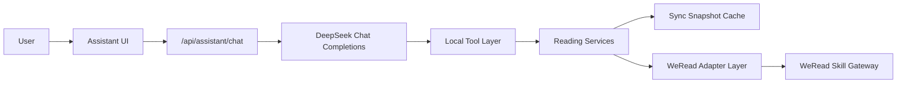

# WeReadAura AI 助手接入方案

## 1. 文档信息

- 项目名称：`WeReadAura`
- 文档版本：`v0.1`
- 文档状态：方案草案
- 编写日期：`2026-05-19`
- 适用阶段：`MVP 方案设计，暂不编码`
- 关联文档：
  - [docs/weread-reading-analytics-prd.md](D:\WeReadAura\docs\weread-reading-analytics-prd.md)
  - [docs/technical-architecture.md](D:\WeReadAura\docs\technical-architecture.md)
  - [docs/frontend-visual-style-guide.md](D:\WeReadAura\docs\frontend-visual-style-guide.md)
  - [AGENTS.md](D:\WeReadAura\AGENTS.md)

## 2. 目标与定位

本方案定义 WeReadAura 中“前端 AI 助手”的接入边界、技术路线、模块拆分与操作步骤。

AI 助手的目标不是做通用聊天机器人，而是做一个围绕“个人阅读分析”的垂直助手，帮助用户：

- 理解当前书架、统计、划线、推荐数据
- 用自然语言发起查询，而不是只靠页面筛选器
- 基于当前同步快照生成解释、总结和复盘建议
- 在数据不完整时给出明确提示，而不是编造答案

当前阶段仅规划只读分析能力，不引入写回、代操作、公开分享和自动执行同步。

## 3. 与现有仓库的关系

当前仓库已经不是纯文档状态，而是具备可运行的 Next.js 单仓全栈骨架，并已有以下基础能力：

- `src/app/api/*`：内部 BFF Route Handlers
- `src/server/services/*`：阅读数据聚合与页面服务层
- `src/server/adapters/weread/*`：微信读书 Skill 适配层
- `src/server/cache/sync-cache.ts`：当前同步快照缓存
- `src/app/settings` 与 `src/app/api/settings/route.ts`：服务端保存密钥的现有模式

因此 AI 助手不应新开第二套后端服务，也不应让浏览器直接访问 DeepSeek API。首版应沿用现有分层，在当前 Next.js BFF 体系内完成接入。

## 4. 范围与非目标

### 4.1 当前范围

- 接入 DeepSeek API 作为模型推理层
- 提供前端聊天入口
- 通过服务端工具读取当前阅读分析数据
- 支持总览、统计、书架、单书、笔记、推荐等问答场景
- 明确数据来源、时间范围、同步状态和降级提示

### 4.2 当前非目标

- 不做浏览器直连模型
- 不做模型直连微信读书 Skill
- 不做自动同步或后台定时任务
- 不做外部知识库、向量库和长期记忆
- 不做多智能体协作
- 不做写回微信读书、书架管理或公开分享

## 5. 核心架构结论

首版 AI 助手采用以下路线：

`前端聊天 UI -> Next.js Route Handler -> DeepSeek Chat API -> 本地工具层 -> 现有阅读服务层 / 同步快照`



该架构的关键原则如下：

- DeepSeek 负责理解和表达，不直接负责事实计算
- 事实数据优先来自本地服务层与同步快照
- 微信读书 Skill 继续只是数据源，不直接暴露给前端 AI
- 统计口径仍由服务层统一定义，避免模型自行推断

## 6. 这个 AI 应用实际使用的技术

本项目中的 AI 助手不是单一技术，而是多层能力组合。

### 6.1 大模型推理

使用 `DeepSeek Chat Completions` 完成：

- 用户意图理解
- 问题改写与补充上下文
- 回答组织
- 总结、解释与复盘表达

模型不负责直接访问数据库或外部网关，而是通过工具拿事实。

### 6.2 Function Calling / Tool Use

这将是首版最关键的 AI 技术。

模型在需要事实数据时，不直接猜测，而是调用本地定义的工具，例如：

- `get_data_source_info`
- `get_dashboard_summary`
- `get_stats_by_period`
- `list_bookshelf`
- `get_book_detail`
- `search_notes`
- `get_recommendations`
- `search_store_books`

本质上是“LLM + Tool Use”的垂直助手形态，而不是纯 prompt 聊天机器人。

### 6.3 Skill 接入

仓库已经具备本地微信读书 Skill 能力与适配层。

在本方案中，`Skill` 的角色是：

- 作为项目的数据来源
- 由 `src/server/adapters/weread/*` 统一调用和隔离
- 不直接交给模型原生调用

因此这里用到了 Skill，但形式是：

`WeRead Skill -> 项目适配层 -> 项目工具层 -> DeepSeek`

而不是：

`DeepSeek -> 直接调用微信读书 Skill`

### 6.4 结构化检索增强

本应用具备明显的“RAG 思想”，但不是经典向量 RAG。

它更准确地属于：

- `tool-based retrieval`
- `snapshot-grounded generation`
- `structured data grounding`

其检索源不是分块文档和向量库，而是：

- 当前同步快照
- 已标准化的书架数据
- 聚合后的统计结果
- 笔记与划线列表
- 单书详情服务

因此可以说它有“检索增强生成”的能力，但不是当前主流意义上的“向量数据库 RAG”。

### 6.5 Prompt Engineering 与 Guardrails

AI 助手需要严格的系统提示词和应用层约束，用于控制：

- 回答边界
- 数据来源标注
- 时间范围表达
- 单位表达
- 缺失数据时的降级话术
- 禁止编造结论

这部分对阅读分析产品尤其重要，因为数据正确性优先级高于文案流畅度。

### 6.6 领域规则与确定性计算

本项目已有大量统计口径与业务规则，这些逻辑不应交给模型自由发挥。

应保持以下分工：

- 服务层负责统计计算、聚合和口径统一
- 模型负责解释、概括和交互

这意味着该 AI 应用其实是“模型表达 + 确定性业务逻辑”的组合，而不是让模型端到端决定一切。

## 7. 当前不建议引入的 AI 技术

MVP 阶段不建议引入以下技术：

- 向量数据库
- Embedding 建库与语义召回
- 文档 chunking / rerank
- 模型微调
- 多智能体编排
- 长期记忆图谱
- 自动规划复杂任务链

原因如下：

- 当前数据源高度结构化
- 问答范围明确且较窄
- 现有服务层已能提供稳定事实
- 引入上述能力会显著增加复杂度，但短期收益有限

## 8. 数据与上下文来源

AI 助手允许使用的上下文来源应限定为：

- 当前连接状态
- 当前同步快照
- 当前服务层聚合结果
- 当前页面上下文中的书籍或筛选条件

不应允许以下来源直接进入模型事实层：

- 未清洗的原始上游 payload
- 未经过口径定义的中间统计值
- 浏览器本地拼装的临时字段
- 前端页面组件内部推导出的隐式业务逻辑

## 9. 推荐模块拆分

建议在当前仓库中新增以下逻辑分层：

```text
src/
  app/
    api/
      assistant/
        chat/
          route.ts
  components/
    features/
      assistant/
        AssistantPanel.tsx
        AssistantMessageList.tsx
        AssistantComposer.tsx
  lib/
    assistant-types.ts
  server/
    adapters/
      ai/
        deepseek-client.ts
        deepseek-types.ts
    services/
      assistant/
        assistant-service.ts
        assistant-tools.ts
        assistant-prompts.ts
        assistant-guards.ts
```

各层职责如下：

- `deepseek-client.ts`：统一封装 DeepSeek API 调用
- `assistant-tools.ts`：定义模型可调用的本地工具
- `assistant-service.ts`：编排对话、工具调用与最终回答
- `assistant-prompts.ts`：集中管理系统提示词
- `assistant-guards.ts`：处理越权、缺数据、同步状态和错误降级
- `AssistantPanel.tsx`：前端聊天抽屉或侧边面板

## 10. 工具设计建议

首版只开放有限、可解释、只读的工具集合。

### 10.1 建议开放的工具

- `get_data_source_info`
  - 作用：返回当前是否已连接、是否已同步、数据来源和最近同步时间
- `get_dashboard_summary`
  - 作用：返回首页核心指标、趋势、推荐摘要
- `get_stats_by_period`
  - 作用：按 `weekly / monthly / annually / overall` 获取统计结果
- `list_bookshelf`
  - 作用：根据关键词、状态、排序返回书架结果
- `get_book_detail`
  - 作用：返回单书详情、进度、划线和热门划线
- `search_notes`
  - 作用：在当前高亮与笔记中按关键词和书籍过滤
- `get_recommendations`
  - 作用：返回推荐书单及推荐理由
- `search_store_books`
  - 作用：搜索书城，并标注是否已在书架

### 10.2 暂不开放的工具

- `run_sync`
- `save_api_key`
- `clear_api_key`
- 任意文件系统访问
- 任意外部网页检索

原因是首版需要严格控制副作用，避免助手变成“高权限代操作入口”。

## 11. API 与会话流程

### 11.1 推荐 API

- `POST /api/assistant/chat`

请求体建议包含：

- 当前用户消息
- 最近少量会话历史
- 可选页面上下文，例如当前页面、当前书籍 ID、当前筛选条件

响应建议包含：

- 助手最终文本
- 本轮是否用到工具
- 工具调用摘要
- 数据来源状态
- 是否需要用户先同步

### 11.2 单轮流程

1. 前端发送用户消息到 `/api/assistant/chat`
2. Route Handler 调用 `assistant-service`
3. `assistant-service` 组织系统提示词、历史消息和页面上下文
4. DeepSeek 判断是否需要工具
5. 若需要，则调用本地工具
6. 服务端把工具结果回填给模型
7. 模型生成最终回答
8. Route Handler 返回统一响应 DTO

## 12. 前端交互方案

首版推荐使用全局聊天抽屉或右侧面板，而不是新增独立页面。

原因如下：

- 更符合“阅读助手”而不是“AI 产品中心”的定位
- 可在任何页面上下文中随时提问
- 便于注入当前路由和当前书籍上下文

前端交互要求：

- 视觉风格遵循 plain neo-brutalism
- 提供空态、加载态、失败态
- 明确显示当前数据状态，例如“演示数据 / 已同步 / 未连接”
- 在答案中标注统计周期、单位和时间范围
- 支持 `prefers-reduced-motion`

## 13. 密钥、权限与安全

DeepSeek API Key 应遵循与 WeRead API Key 相同的安全原则：

- 不保存在前端 localStorage
- 不暴露给浏览器
- 优先保存在服务端环境变量
- 如未来需要页面配置，也应保存在 `HTTP-only cookie` 或服务端配置层

安全边界要求：

- 不把完整笔记正文、令牌和用户标识输出到日志
- 不把原始上游 payload 直接发送给模型
- 对传给模型的上下文进行字段最小化裁剪
- 回答中避免泄露不必要的个人阅读明细

## 14. 回答规范

AI 助手的回答应遵守以下规则：

- 优先基于当前同步数据回答
- 明确说明时间范围，例如“最近 30 天”“本月”“累计”
- 所有时长必须带单位
- 当数据缺失时明确说明“当前没有该项数据”
- 当未连接或未同步时明确提示，不伪装成真实分析结果
- 不编造书名、作者、时长、统计趋势和推荐原因

## 15. 错误处理与降级策略

需要覆盖以下错误场景：

- 未配置 WeRead API Key
- 已配置但尚未同步
- WeRead Skill 拉取失败
- DeepSeek API 超时或失败
- 工具调用参数不合法
- 当前页面上下文不足

推荐降级行为：

- DeepSeek 失败时返回清晰的系统错误提示
- 工具失败时优先返回“当前无法读取该类数据”
- 只要事实层不可靠，就不输出强结论
- 在 mock 模式下明确标记“当前为演示数据”

## 16. 分阶段实施建议

### 阶段一：MVP

- DeepSeek 接入
- 单一聊天面板
- 只读工具调用
- 面向当前同步快照的问答
- 不做流式输出也可接受

### 阶段二：体验增强

- 流式输出
- 页面上下文注入优化
- 常见问题快捷入口
- 更细粒度的书籍和笔记问答

### 阶段三：数据层增强

- PostgreSQL 落地后接入持久化会话
- 同步快照历史化
- 支持跨周期对比和长期阅读复盘

## 17. 实施前检查清单

在正式编码前，至少先确认以下问题：

1. DeepSeek Key 是否仅通过服务端环境变量管理
2. 助手是否严格限制为只读
3. 工具列表是否只暴露必要查询能力
4. 是否统一复用现有 `reading-data.ts` 和相关服务层
5. 是否为回答补充数据来源、时间范围和单位规则
6. 是否在设置页或聊天面板中清楚标注同步状态
7. 是否明确 mock 模式下的回答策略

## 18. 结论

WeReadAura 的 AI 助手应被定义为：

- 一个垂直的阅读分析助手
- 一个基于结构化数据和同步快照的工具增强型 LLM 应用
- 一个使用 Skill 作为数据来源、但不让模型直接接触上游外部协议的安全架构

它当前最适合采用的技术组合是：

- `DeepSeek Chat Completions`
- `Function Calling / Tool Use`
- `WeRead Skill Adapter`
- `结构化数据 grounding`
- `Prompt + Guardrails`
- `服务端确定性统计逻辑`

MVP 阶段不需要过早引入向量 RAG、多智能体或复杂记忆系统。先把“事实正确、边界明确、体验顺滑”的只读阅读助手做好，是当前最合理的落地路径。
