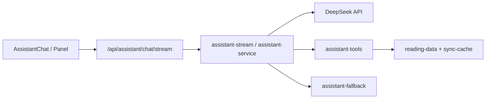
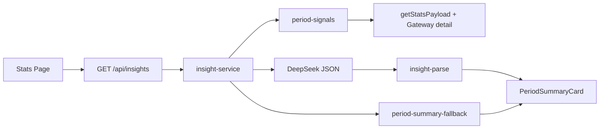

# WeReadAura AI 功能实现总结

> 更新日期：2026-05-20  
> 适用仓库阶段：MVP + 全局阅读助手 + 统计页周期摘要（实习演示向）

## 1. 已实现能力一览

| 模块 | 入口 | 说明 |
| --- | --- | --- |
| 全局阅读助手 | `/assistant`、侧栏 FAB、顶栏「助手」 | 多轮对话、页面上下文、只读工具调用 |
| 单书笔记助手 | `/books/[bookId]` 笔记区底部 | 引用划线/想法后提问，上下文带入 API |
| 流式回复 | `POST /api/assistant/chat/stream` | SSE 推送；工具轮次后分段输出正文 |
| 周期阅读摘要 | 统计页卡片 + `GET /api/insights?type=period-summary` | 信号层 → LLM JSON / 规则降级 |
| 设置说明 | `/settings` AI 卡片 | 数据边界、隐私、模型配置状态 |

**未实现（仍见规划文档）**：阅读人格卡片、首页/书架/笔记/发现页内嵌洞察、`period-report` 长报告、向量记忆、写回等。

## 2. 技术栈与外部依赖

- **模型**：DeepSeek Chat Completions（`deepseek-chat`），环境变量 `DEEPSEEK_API_KEY`
- **运行时**：Next.js App Router Route Handlers（BFF），不向浏览器暴露 Key
- **微信读书数据**：官方 Skill API（Gateway），经 `src/server/adapters/weread/*` 适配
- **本地快照**：`src/server/cache/sync-cache.ts`（同步后 `live`，否则 `mock`）
- **前端渲染**：`react-markdown` + `remark-gfm`，样式 `neo-prose--assistant` + 聚珍新仿引用块

## 3. 全局阅读助手架构



### 3.1 上下文管理

- **请求体**：`message`、`history`（截断消毒）、`context.pathname`、`context.bookId`、`context.quotedHighlights`（单书页引用笔记，最多 5 条）
- **系统提示**：`assistant-prompts.ts` 注入数据来源、同步状态、当前路由语义（统计/笔记/单书）
- **页面感知**：客户端从 `usePathname` / URL 解析 `bookId`；单书页快捷提问单独配置
- **回答规范**：`assistant-markdown-rules.ts` + `AGENTS.md` §11.1

### 3.2 Skill 工具层（只读）

定义于 `assistant-tools.ts`，模型通过 function calling 调用：

| 工具 | 作用 |
| --- | --- |
| `get_data_source_info` | 同步状态、演示/live |
| `get_dashboard_summary` | 首页聚合 |
| `get_stats_by_period` | 周期统计与洞察高亮 |
| `list_bookshelf` | 书架筛选 |
| `get_book_detail` | 单书进度与划线摘要 |
| `search_notes` | 笔记/划线检索 |
| `get_recommendations` | 推荐书单 |
| `search_store_books` | 书城搜索 |

数据均在服务端截断（书目/笔记条数、摘录长度），避免把全文笔记送入模型。

### 3.3 流式输出

- 路由：`src/app/api/assistant/chat/stream/route.ts`（`text/event-stream`）
- 逻辑：`assistant-stream.ts` — 工具轮次仍为非流式 completion；最终自然语言按块 `delta` 推送，结尾 `done` 含完整 `reply` 与 `usedTools`
- 降级：无 Key / 模型失败时走 `assistant-fallback.ts`，同样以 SSE 返回

### 3.4 降级与安全

- `assistant-guards.ts`：消息长度、历史条数、演示数据提示
- 无 DeepSeek：关键词匹配 + 工具 JSON 摘要（`assistant-fallback.ts`）
- 禁止心理诊断式人格结论（提示词 + 周期摘要提示词双重约束）

## 4. 统计页周期摘要（页面型 AI）



### 4.1 信号层（确定性）

`period-signals.ts` 从统计 payload 提取：

- 周期标签、阅读天数、总时长、环比
- 现有 `insights.highlights`、排行、偏好作者
- `confidence`：`readDays < 3` → low，避免强结论

### 4.2 模型归纳

- 输入：压缩后的 JSON 事实（`insight-prompts.ts`）
- 输出：要求**纯 JSON**（headline、keyFindings、evidence 等）
- 解析：`insight-parse.ts`；失败则 **100% 回退** 规则摘要

### 4.3 产品约束（演示雷区规避）

- **不做**「XX 型读者」等人格标签
- 卡片展示 evidence、confidence、演示/AI/规则来源徽章
- 可展开「依据与说明」，链接至阅读助手继续追问

## 5. 关键文件索引

| 路径 | 职责 |
| --- | --- |
| `src/app/api/assistant/chat/route.ts` | 非流式对话 |
| `src/app/api/assistant/chat/stream/route.ts` | SSE 流式对话 |
| `src/app/api/insights/route.ts` | 周期摘要 API |
| `src/server/services/assistant/*` | 对话、工具、降级、流式 |
| `src/server/services/insights/*` | 信号、摘要、解析 |
| `src/server/adapters/ai/deepseek-client.ts` | DeepSeek HTTP |
| `src/components/features/assistant/*` | 助手 UI |
| `src/components/features/books/BookNotesAssistant.tsx` | 单书页嵌入式助手 |
| `src/lib/assistant-quote.ts` | 引用笔记格式化与并入用户消息 |
| `src/components/features/insights/PeriodSummaryCard.tsx` | 统计页卡片 |

## 6. 环境配置

```bash
# .env.local
DEEPSEEK_API_KEY=sk-...   # 可选；未配置时助手与摘要均走规则降级
WEREAD_API_KEY=wrk-...    # 微信读书 Skill（设置页或 env）
```

## 7. 演示建议（Vibe Coding）

1. 设置页：说明 AI 边界 → 同步数据（或演示数据）
2. 统计页：切换周期 → 展示周期摘要卡片（证据 + 置信度）
3. 助手页：提问「最近读得怎么样」→ 展开「本次读取：工具名」→ 观察流式输出
4. 单书页：打开侧栏 → 点「这本书对我意味着什么」

## 8. 关联文档

- [ai-assistant-architecture.md](./ai-assistant-architecture.md) — 目标架构与完整工具清单
- [ai-insight-schema-design.md](./ai-insight-schema-design.md) — 洞察 DTO 与信号设计
- [ai-ui-surface-plan.md](./ai-ui-surface-plan.md) — 全站 AI 落点规划
- [neo-brutalism-markdown-guide.md](./neo-brutalism-markdown-guide.md) — 助手 Markdown 与引用样式
