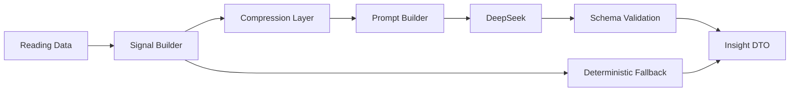

# WeReadAura AI 洞察指标与 Schema 设计

## 1. 文档信息

- 项目名称：`WeReadAura`
- 文档版本：`v0.1`
- 文档状态：方案草案
- 编写日期：`2026-05-19`
- 适用阶段：`AI 洞察模块设计，暂不编码`
- 关联文档：
  - [docs/ai-assistant-architecture.md](D:\WeReadAura\docs\ai-assistant-architecture.md)
  - [docs/technical-architecture.md](D:\WeReadAura\docs\technical-architecture.md)
  - [docs/weread-reading-analytics-prd.md](D:\WeReadAura\docs\weread-reading-analytics-prd.md)

## 2. 文档目标

本文件用于把 WeReadAura 的 AI 洞察能力从“概念方案”进一步细化为可实施设计，重点回答以下问题：

- 页面式 AI 洞察到底有哪些类型
- 每种洞察依赖哪些事实输入
- 哪些信号应由服务端确定性计算
- 哪些部分适合交给模型做归纳和表达
- 上下文应如何压缩，避免把无关数据全量发送给模型
- 页面最终应消费怎样的结构化 JSON 输出

本文件主要面向：

- AI 能力实现
- 服务端数据编排
- 前端洞察卡片渲染
- 后续测试与评估

## 3. 总体设计原则

AI 洞察模块必须遵循以下原则：

- 先有事实，再有结论
- 先做结构化信号，再做模型归纳
- 先裁剪上下文，再发送给模型
- 页面优先消费结构化 DTO，而不是自由文本
- 每个洞察都应有证据字段和降级路径

推荐流水线如下：



## 4. 洞察模块清单

建议首批 AI 洞察模块固定为以下五类：

- `reading-persona`
- `reading-preference`
- `reading-behavior`
- `period-summary`
- `period-report`

后续可扩展：

- `book-retrospective`
- `recommendation-explain`
- `note-theme-summary`
- `reread-candidates`

## 5. 信号层设计

在进入模型前，先由服务端构建统一 signal layer。信号层不是最终 UI，也不是原始数据，而是为 AI 洞察服务的中间事实层。

### 5.1 信号分类

建议分为五类信号：

- `volume signals`
  - 阅读总时长、活跃天数、完成册数、在读册数
- `structure signals`
  - 分类分布、作者分布、出版社分布、阅读/听书占比
- `behavior signals`
  - 阅读时段、波动性、连续性、单书平均投入
- `output signals`
  - 划线数量、笔记数量、笔记密度、单书产出排行
- `evidence signals`
  - 代表性书籍、代表性划线、代表性笔记、趋势拐点

### 5.2 建议优先沉淀的信号字段

首版建议尽快沉淀以下字段，这些字段足以支撑大多数页面式 AI 洞察：

- `period`
- `periodStart`
- `periodEnd`
- `totalReadMinutes`
- `activeReadDays`
- `finishedBookCount`
- `readingBookCount`
- `bookshelfTotal`
- `avgMinutesPerActiveDay`
- `avgMinutesPerBook`
- `highlightCount`
- `noteCount`
- `noteDensityPerBook`
- `topCategories`
- `topAuthors`
- `topPublishers`
- `preferTimeBuckets`
- `readListenMix`
- `trendSlope`
- `trendVolatility`
- `readingConsistency`
- `completionRate`
- `highInvestmentBooks`
- `highOutputBooks`
- `underfinishedButHighValueBooks`
- `representativeHighlights`
- `representativeNotes`

### 5.3 信号命名建议

建议所有信号字段满足以下要求：

- 名称语义明确
- 单位明确
- 避免模型自行猜字段含义
- 尽量避免直接复用上游模糊字段名

例如：

- 用 `totalReadMinutes`，不要只叫 `readTime`
- 用 `finishedBookCount`，不要只叫 `count`
- 用 `readingConsistency`，并在 schema 中说明取值范围和定义

## 6. 上下文压缩策略

上下文压缩是本项目的关键技术策略之一。

### 6.1 压缩目标

压缩的目标不是“省 token”这么简单，而是：

- 减少噪声
- 控制结论漂移
- 降低模型误读概率
- 保持洞察风格稳定
- 降低运行成本

### 6.2 压缩层级

建议统一采用三级上下文：

- `L1 指标层`
  - 已聚合指标、排行、分布、趋势特征
- `L2 证据层`
  - 少量代表性书籍、划线、笔记样本
- `L3 原始层`
  - 仅在必要时读取的明细内容

默认规则：

- 页面型洞察优先只用 `L1`
- 需要解释“为什么”的场景再引入 `L2`
- `L3` 默认禁用，除非明确需要

### 6.3 压缩动作

常见压缩动作包括：

- 时间裁剪
- 书籍去重
- 按相关性取 Top N
- 对长文本做片段截断
- 先抽象后传递，不传无关字段

### 6.4 各模块压缩策略

#### `reading-persona`

建议上下文：

- `L1`：总时长、活跃天数、完成册数、偏好分类、阅读时段、产出密度
- `L2`：1 到 3 本代表性书籍

不建议加入：

- 全量笔记正文
- 全书架列表

#### `reading-preference`

建议上下文：

- `L1`：分类分布、作者分布、出版社分布、阅读/听书占比
- `L2`：Top 3 代表书籍

#### `reading-behavior`

建议上下文：

- `L1`：趋势、连续性、波动性、活跃日、单书投入
- `L2`：最近阶段的趋势拐点样本

#### `period-summary`

建议上下文：

- `L1`：周期核心指标与同比/环比信号
- `L2`：代表书籍、代表笔记、代表趋势点

#### `period-report`

建议上下文：

- `L1`：年度聚合结果与分段结果
- `L2`：代表性书、主题、笔记
- 不要直接传全年全部原始事件

## 7. 洞察模块 Schema 设计

### 7.1 通用输出结构

所有页面式 AI 洞察建议共享一个基础结构：

```ts
interface InsightBase {
  type: string;
  period: "weekly" | "monthly" | "annually" | "overall";
  generatedAt: string;
  sourceMode: "mock" | "live";
  title: string;
  summary: string;
  confidence: "low" | "medium" | "high";
  evidence: string[];
  disclaimer?: string;
}
```

额外规则：

- `evidence` 至少 1 条，最多 4 条
- `summary` 控制在 1 到 3 句
- `disclaimer` 在人格和阶段性总结场景建议始终保留

### 7.2 阅读人格 Schema

用途：

- 首页卡片
- 统计页洞察卡片
- 阶段性总结视图中的阶段画像

建议结构：

```ts
interface ReadingPersonaInsight extends InsightBase {
  type: "reading-persona";
  label: string;
  tone: "yellow" | "green" | "blue" | "pink" | "white";
  traits: string[];
  basedOn: {
    categoryFocus?: string;
    timePreference?: string;
    consistency?: string;
    outputStyle?: string;
  };
}
```

字段说明：

- `label`
  - 例如“稳定深读型”“晚间沉浸型”“主题聚焦型”
- `traits`
  - 2 到 4 个短标签
- `basedOn`
  - 明确告诉前端，这个画像主要基于哪些维度得出

### 7.3 阅读偏好 Schema

用途：

- 统计页偏好解释
- 发现页推荐解释补充

建议结构：

```ts
interface ReadingPreferenceInsight extends InsightBase {
  type: "reading-preference";
  labels: Array<{
    name: string;
    reason: string;
  }>;
  focusAreas: {
    categories: string[];
    authors: string[];
    publishers: string[];
    timeOfDay?: string[];
  };
  shifts?: string[];
}
```

字段说明：

- `labels`
  - 每个偏好标签都带一条原因
- `shifts`
  - 用于表达近周期偏好的变化

### 7.4 阅读行为 Schema

用途：

- 统计页行为卡片
- 首页行为摘要

建议结构：

```ts
interface ReadingBehaviorInsight extends InsightBase {
  type: "reading-behavior";
  pattern: string;
  rhythm: string;
  outputBalance: string;
  risks: string[];
  strengths: string[];
}
```

字段说明：

- `pattern`
  - 总体行为模式名
- `rhythm`
  - 节奏类一句话说明
- `outputBalance`
  - 输入与产出平衡情况
- `risks`
  - 0 到 3 条
- `strengths`
  - 1 到 3 条

### 7.5 阶段总结 Schema

用途：

- 周报、月报模块
- 首页“最近一个月”

建议结构：

```ts
interface PeriodSummaryInsight extends InsightBase {
  type: "period-summary";
  headline: string;
  keywords: string[];
  keyFindings: string[];
  notableBooks: Array<{
    bookId: string;
    title: string;
    reason: string;
  }>;
  noteThemes: string[];
  nextSuggestions?: string[];
}
```

字段说明：

- `headline`
  - 页面重点标题
- `keywords`
  - 2 到 4 个周期关键词
- `keyFindings`
  - 3 到 5 条核心结论
- `nextSuggestions`
  - 可选，用于轻量建议

### 7.6 阶段性总结视图 Schema

用途：

- 独立阶段性总结视图
- 周期性图文总结内容来源

建议结构：

```ts
interface PeriodReportInsight {
  type: "period-report";
  period: "weekly" | "monthly" | "annually" | "overall";
  generatedAt: string;
  sourceMode: "mock" | "live";
  headline: string;
  subheadline: string;
  persona?: string;
  periodKeywords: string[];
  keyMoments: string[];
  readingPatterns: string[];
  booksToRemember: Array<{
    bookId: string;
    title: string;
    reason: string;
  }>;
  noteThemeSummary: string[];
  closingMessage: string;
  evidence: string[];
  disclaimer?: string;
}
```

字段规则：

- `periodKeywords`
  - 3 到 5 个
- `keyMoments`
  - 3 到 6 条
- `readingPatterns`
  - 2 到 4 条
- `booksToRemember`
  - 3 到 5 本

## 8. 输入事实 Schema 建议

建议页面式 AI 不直接读散落的 service 返回值，而是先统一成事实对象。

### 8.1 通用 Period Facts

```ts
interface PeriodInsightFacts {
  period: "weekly" | "monthly" | "annually" | "overall";
  periodStart: string;
  periodEnd: string;
  sourceMode: "mock" | "live";
  metrics: {
    totalReadMinutes: number;
    activeReadDays: number;
    finishedBookCount: number;
    readingBookCount: number;
    highlightCount: number;
    noteCount: number;
  };
  behavior: {
    readingConsistency: number;
    trendSlope: "up" | "flat" | "down";
    trendVolatility: "low" | "medium" | "high";
    topReadTimeWord?: string;
  };
  preferences: {
    topCategories: string[];
    topAuthors: string[];
    topPublishers: string[];
  };
  books: {
    highInvestment: Array<{ bookId: string; title: string; minutesRead: number }>;
    highOutput: Array<{ bookId: string; title: string; noteCount: number; highlightCount: number }>;
  };
  evidenceSamples: {
    highlights: string[];
    notes: string[];
  };
}
```

### 8.2 阶段性总结视图 Facts

```ts
interface PeriodReportFacts {
  period: "weekly" | "monthly" | "annually" | "overall";
  periodStart: string;
  periodEnd: string;
  sourceMode: "mock" | "live";
  totals: {
    totalReadMinutes: number;
    activeReadDays: number;
    finishedBookCount: number;
    highlightCount: number;
    noteCount: number;
  };
  segments: Array<{
    label: string;
    minutes: number;
    finishedBooks: number;
  }>;
  topCategories: string[];
  topAuthors: string[];
  highInvestmentBooks: Array<{ bookId: string; title: string; minutesRead: number }>;
  highOutputBooks: Array<{ bookId: string; title: string; noteCount: number }>;
  representativeThemes: string[];
  representativeNotes: string[];
}
```

## 9. 模型与确定性逻辑的边界

建议明确以下边界。

### 9.1 必须由确定性逻辑完成

- 指标计算
- 排名
- 分布占比
- 趋势方向
- 周期切分
- 证据候选抽样
- 单位转换

### 9.2 可以让模型参与的部分

- 洞察标题命名
- 人格标签归纳
- 多信号合成一句自然语言
- 阶段总结与阶段性总结视图叙事
- 把证据压缩为更短、更可读的说明

### 9.3 不应让模型决定的部分

- 口径定义
- 指标真假
- 阅读时长换算
- 排序逻辑
- 是否存在某本书、某条笔记

## 10. Prompt 设计建议

每类洞察都应有独立 prompt 模板，不建议用一个超长万能 prompt。

### 10.1 Prompt 结构建议

每个模板推荐包含：

- 角色定义
- 任务目标
- 输出结构要求
- 风格要求
- 禁止事项
- 当前事实对象

### 10.2 关键约束建议

建议在所有页面型洞察 prompt 中固定加入：

- 只能基于提供的 facts 输出
- 不得编造书名、时间、数字
- 不得使用心理测评式绝对判断
- 每条结论必须可被 evidence 支撑
- 若样本不足，则降低 confidence 并收敛表达

## 11. 降级策略

每类页面式 AI 洞察都必须有服务端降级方案。

### 11.1 模型失败降级

当模型失败时：

- 人格卡片回退为规则标签 + 模板文案
- 偏好卡片回退为分类/作者/时段的确定性总结
- 行为卡片回退为趋势与活跃度摘要
- 阶段总结回退为指标摘要卡
- 阶段性总结视图回退为周期指标版报告

### 11.2 Schema 失败降级

当模型返回字段缺失或格式错误时：

- 尝试局部修复
- 若修复失败，回退到确定性结果
- 不把非法结构直接返回前端

## 12. 测试与评估建议

建议为每种洞察准备固定评测样本。

### 12.1 测试维度

- 是否引用了正确周期
- 是否使用了正确单位
- 是否出现编造
- 是否和 evidence 一致
- 是否在数据不足时降级表达
- 是否满足 schema

### 12.2 评测样例建议

每种洞察至少准备：

- 正常 live 数据样例
- mock 数据样例
- 数据稀疏样例
- 高笔记密度样例
- 高阅读低产出样例
- 多主题分散样例

## 13. 推荐实施顺序

建议按以下顺序推进：

1. 先定义 signal layer
2. 再定义 `PeriodInsightFacts` 和 `PeriodReportFacts`
3. 完成 `reading-preference` 与 `reading-behavior`
4. 再做 `reading-persona`
5. 再做 `period-summary`
6. 最后做 `period-report`

这样安排的原因是：

- 偏好和行为更接近确定性信号，容易先做稳
- 人格和阶段性总结视图更依赖模型表达，适合放后面

## 14. 结论

WeReadAura 的页面式 AI 洞察不应被实现成“把一堆数据扔给模型，让模型自由发挥”的模式，而应实现为：

- 先构建统一 signal layer
- 再做按任务的上下文压缩
- 再用模型完成有限归纳和表达
- 最终返回稳定、可测、可降级的结构化 DTO

如果这一层设计先定清楚，后续无论接聊天助手、首页洞察卡片还是阶段性阅读总结，都会更稳，也更符合项目对数据正确性和可维护性的要求。
