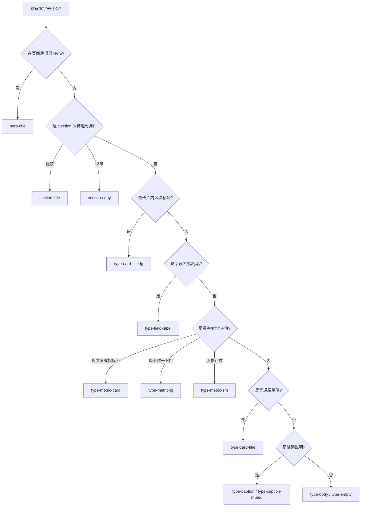

# 字段排版选型指南

本文档规定 **WeReadAura** 中各类 UI 字段应使用哪一类排版 token。实现以 `src/styles/typography.css` 为准；新增页面或组件时按 **字段语义** 选型，不要按「看起来大不大」临时写 `text-*`。

相关文档：

- 色彩、边框、组件外观：[frontend-visual-style-guide.md](./frontend-visual-style-guide.md)
- Token 定义与响应式字号：[../src/styles/typography.css](../src/styles/typography.css)

---

## 1. 基本原则

1. **一层信息一个层级**：同一卡片内，标题 > 字段名 > 数值 > 辅助说明，相邻层级字号差不宜超过约 1.25～1.5 倍。
2. **页面标题与卡片标题分开**：页面级用 `section-title` / `hero-title`；卡片内区块用 `type-card-title-lg`，禁止在卡片里使用 `type-section-title`（会与页面 H2 同级，造成悬殊）。
3. **优先语义 class**：使用 `type-*`，禁止在业务组件中散落 `text-2xl`、`text-sm` 等 Tailwind 字号。
4. **长数值可换行**：时长、日期时间等用 `type-metric-card`（含 `text-wrap: balance`），不要用超大 `type-metric-lg`。
5. **字重约定**：标题类 token 均为 `font-heading`（700）；正文、说明为 `font-base`（500）。

---

## 2. 信息层级（由高到低）

```text
L0  站点 / 页面 Hero          hero-title, type-hero
L1  页面区块标题              section-title (= type-section-title)
L2  页面区块说明              section-copy (= type-section-copy)
L3  眉标 / 分类标签           neo-eyebrow + type-eyebrow
L4  卡片 / 面板区块标题        type-card-title-lg
L5  卡片内副信息（作者等）     type-card-subtitle
L6  字段名（指标名、表单项）   type-field-label
L7  强调数值（指标卡主值）     type-metric-card
L8  单卡主 KPI（进度%、同步）  type-metric-lg
L9  紧凑数字（计数）          type-metric-sm
L10 普通字段值（日期、短文本） type-card-title
L11 正文 / 列表内容           type-body, type-body-lg
L12 辅助说明（单位、环比）     type-caption, type-caption-muted
L13 空态 / 占位               type-empty
```

同一视图中，**不要跳级**：例如 L6 字段名下面直接接 L1 页面标题。

---

## 3. 按字段类型选型

### 3.1 页面与导航

| 字段类型 | 示例 | 推荐 class | 说明 |
|----------|------|------------|------|
| 全站 Hero 主标题 | 「你的微信读书阅读全貌…」 | `hero-title` 或 `type-hero` | 仅首页 Hero、营销级入口 |
| 页面区块标题 | 「阅读统计」「趋势与分类」 | `section-title` | `Section` 组件已内置 |
| 页面区块说明 | 「以下数据来自微信读书…」 | `section-copy` | 1～2 句，勿过长 |
| 区块眉标 | 「统计」「书架」 | `neo-eyebrow` | 胶囊边框样式 |
| 导航品牌 | WeReadAura | `type-nav-brand` | 顶栏 Logo 文案 |
| 导航链接 | 书架、笔记 | `type-nav-link` | 默认导航项 |
| 文内链接 | 查看详情 | `type-link` | 带下划线 |

### 3.2 卡片结构

| 字段类型 | 示例 | 推荐 class | 说明 |
|----------|------|------------|------|
| 卡片 / 图表区块标题 | 「阅读趋势」「分类占比」 | `type-card-title-lg` | 可用 `ChartCardHeading` |
| 书籍 / 实体主标题 | 书名（卡片内） | `type-card-title` 或页面 `Section` 标题 | 长书名用 `Section title` |
| 作者、分类副题 | 吴毅 · 社会文化 | `type-card-subtitle` | `font-base`，弱于标题 |
| 卡片正文 | 简介摘要 | `type-body` / `type-body-lg` | 多行说明 |

### 3.3 指标与数据

| 字段类型 | 示例 | 推荐 class | 说明 |
|----------|------|------------|------|
| 指标名称 | 「阅读时长」「读完书籍」 | `type-field-label` | 指标卡、轨迹格统一用此 |
| 指标主值（可较长） | `241 小时 54 分钟`、`1,228` | `type-metric-card` | 四宫格 `MetricCard` 默认 |
| 单卡核心 KPI | `67%`、上次同步时间 | `type-metric-lg` | 每卡仅 1 个，勿滥用 |
| 紧凑计数 | 在读 `12`、划线 `86` | `type-metric-sm` | 小格、次要数字 |
| 中等强调数字 | 较少使用 | `type-metric` | 无更长文案时可选 |
| 字段值（非强调） | 日期、时长明细、`0 / 192` | `type-card-title` | 与 `type-field-label` 成对 |
| 指标辅助 | 「本月」「暂无环比」 | `type-caption-muted` | 低于主值一级 |
| 图表轴 / 图例 | 由 Recharts + 主题色 | 见 `chart-theme.ts` | 不单独放大字号 |

### 3.4 列表与内容

| 字段类型 | 示例 | 推荐 class | 说明 |
|----------|------|------------|------|
| 列表项标题 | 书名（行内） | `type-card-title` | `BookCard` 等 |
| 列表项元信息 | 章节、时间 | `type-caption` | |
| 划线 / 笔记引用 | 原文摘录 | `type-body` | 长文保持可读行高 |
| 章节标签 | 「第 3 章」 | `type-caption` | |
| 空数据提示 | 暂无趋势数据 | `type-empty` | 图表、列表空态 |

### 3.5 表单与筛选

| 字段类型 | 示例 | 推荐 class | 说明 |
|----------|------|------------|------|
| 表单区块标题 | 搜索书城 | `type-card-title-lg` | |
| 输入框 / 下拉 | — | 组件默认 `text-sm` | 见 `Input` 包装层 |
| 筛选结果统计 | 显示 12 / 387 本 | `type-caption` | |

### 3.6 状态与标签

| 字段类型 | 示例 | 推荐 class | 说明 |
|----------|------|------------|------|
| 状态徽章 | 在读、已读完 | `Badge` 组件 | 不单靠颜色，必有文字 |
| 分类标签 | 社会文化-社科 | `Badge` | 不用 `type-*` 替代 |

---

## 4. 常见布局模式

### 4.1 指标四宫格（`MetricCard`）

```text
type-field-label     ← 指标名
type-metric-card     ← 主值（可换行）
type-caption-muted   ← 本月 / 环比
```

### 4.2 图表卡片（`ChartCardHeading` + 图表）

```text
type-card-title-lg   ← 阅读趋势
type-caption         ← 近 7 天每日…
[ChartContainer]
```

### 4.3 键值对网格（书籍详情 · 阅读轨迹）

```text
type-card-title-lg       ← 区块名「阅读轨迹」
  type-field-label       ← 开始阅读
  type-card-title        ← 2025-12-09
```

### 4.4 单书进度主卡

```text
type-card-subtitle   ← 作者
type-metric-lg       ← 67%（本卡唯一大数）
type-field-label     ← 当前进度
[进度条]
```

### 4.5 首页 Hero + 同步侧栏

```text
neo-eyebrow + hero-title + section-copy    ← 左侧 Hero
type-field-label + type-metric-lg          ← 上次同步（侧栏主信息）
type-field-label + type-metric-sm          ← 在读 / 划线计数
```

---

## 5. 决策流程



---

## 6. 禁止与不推荐

| 不推荐 | 应改为 |
|--------|--------|
| 卡片标题用 `type-section-title` | `type-card-title-lg` |
| 指标名用 `type-label`（旧习惯） | `type-field-label` |
| 指标卡主值用 `type-metric` / `type-metric-lg` | `type-metric-card` |
| 同一卡内多个 `type-metric-lg` | 仅保留一个主 KPI，其余降级 |
| 业务组件写 `text-3xl font-bold` | 对应 `type-metric-*` |
| 用字号表达状态（在读/读完） | `Badge` + 文案 |

`type-label` 仍保留以兼容旧代码，**新代码请用 `type-field-label`**。

---

## 7. 扩展新字段类型时

1. 先在本表找一个最接近的「字段类型」行。
2. 若无合适 token，在 `typography.css` 增加 **语义化** class（如 `type-metric-card`），勿新增仅用于单页的 class。
3. 更新本文档对应表格。
4. 在 PR 中说明层级关系（夹在 L几 与 L几 之间）。

---

## 8. 快速查阅表（仅 class 名）

| class | 典型用途 |
|-------|----------|
| `hero-title` / `type-hero` | 首页 Hero H1 |
| `section-title` | 页面 H2 |
| `section-copy` | 页面说明段 |
| `neo-eyebrow` | 区块眉标 |
| `type-card-title-lg` | 卡片 / 图表区块标题 |
| `type-card-title` | 字段值、列表标题 |
| `type-card-subtitle` | 作者、副标题 |
| `type-field-label` | 字段名、指标名 |
| `type-metric-card` | 指标卡主值 |
| `type-metric-lg` | 单卡主 KPI |
| `type-metric-sm` | 紧凑数字 |
| `type-metric` | 中等强调数字（少用） |
| `type-caption` | 一般辅助说明 |
| `type-caption-muted` | 更弱的辅助说明 |
| `type-body` | 正文、摘录 |
| `type-empty` | 空态 |

---

*文档版本：与 `typography.css` 2026-05 调整同步。若实现与本文冲突，以代码与产品确认为准，并回写本文档。*
