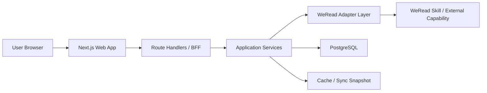

# WeReadAura 技术方案

## 1. 文档信息

- 项目名称：`WeReadAura`
- 文档版本：`v0.1`
- 文档状态：技术方案草案
- 编写日期：`2026-05-16`
- 对应需求文档：[docs/weread-reading-analytics-prd.md](D:\WeReadAura\docs\weread-reading-analytics-prd.md)
- 对应视觉规范：[docs/frontend-visual-style-guide.md](D:\WeReadAura\docs\frontend-visual-style-guide.md)

## 2. 架构结论

本项目首版采用 `Next.js App Router + TypeScript + PostgreSQL` 的单仓全栈方案，不单独拆分第二个后端服务。

核心判断如下：

- 前端页面较多，但都围绕同一个个人阅读分析域
- 首版更需要快速打通“接入数据 -> 聚合分析 -> 展示页面”的闭环
- 微信读书接入存在字段与权限不确定性，先通过适配层隔离，而不是过早拆成多服务
- 统计聚合、列表查询、详情查询都能在同一套 TypeScript 代码中完成，能显著降低 MVP 成本
- 后续如果同步任务、报告生成或多用户规模明显增长，再从当前架构平滑拆出独立 worker / API 服务

## 3. 目标架构



分层职责如下：

- `Web UI`：页面、布局、组件、交互、图表
- `BFF`：对前端暴露稳定接口，隐藏外部数据源复杂度
- `Application Services`：同步、聚合、分析、排序、筛选
- `Adapter Layer`：封装微信读书 skill 或后续替代接入方式
- `Database`：保存标准化后的业务数据、同步快照和用户偏好

## 4. 技术栈

### 4.1 核心栈

| 层 | 选择 | 用途 | 选择理由 |
| --- | --- | --- | --- |
| Web Framework | `Next.js App Router` | 页面路由、服务端渲染、BFF | 原生支持文件路由、layout、Server Components、Route Handlers，适合仪表盘与多页面应用 |
| UI Runtime | `React` | 组件开发 | 生态成熟，和 Next.js 深度对齐 |
| 语言 | `TypeScript` | 全栈类型约束 | 页面、接口、数据模型统一类型系统 |
| 样式 | `Tailwind CSS + CSS Variables` | 设计 token 与页面样式 | 适合快速落地 neo-brutalism 设计系统，同时保留 token 控制力 |
| 数据库 | `PostgreSQL` | 业务数据持久化 | 关系模型清晰，适合书籍、笔记、统计聚合、快照数据 |
| ORM | `Drizzle ORM` | schema、查询、迁移 | TypeScript 友好，SQL 心智负担低，结构透明 |
| 参数/数据校验 | `Zod` | env、API DTO、外部数据兜底 | 可以把“上游字段不稳定”问题前置成显式校验 |
| 客户端服务端状态 | `TanStack Query` | 仅用于高交互客户端数据 | 对筛选、分页、刷新、缓存更稳；但不在全站滥用 |
| 测试 | `Vitest + Testing Library + Playwright` | 单元、组件、端到端测试 | 分别覆盖纯逻辑、UI 行为和关键流程 |

### 4.2 不采用的方案

### 不采用前后端双仓或双服务

当前不采用 `Next.js + FastAPI` 双服务形态，原因如下：

- MVP 阶段多一套后端会增加认证、部署、接口联调和共享类型成本
- 当前业务更像“个人数据产品”，不是高并发开放平台
- 统计分析复杂度还不足以要求单独 Python 服务

### 不采用大型现成 UI 组件库作为主骨架

当前不采用 `shadcn/ui` 风格作为主视觉基座，原因如下：

- 项目视觉要求明确，不希望落回通用 SaaS 仪表盘质感
- neo-brutalism 更适合从 token 和基础组件自己搭一层

### 不采用全局客户端状态库作为默认方案

MVP 阶段不默认引入 `Zustand`、`Redux` 一类全局状态库。

优先级如下：

- 首屏数据：Server Components
- 可刷新的局部服务端数据：TanStack Query
- 筛选与分页：URL Search Params
- 轻量交互状态：组件本地 state

## 5. 接入策略

### 5.1 微信读书接入原则

微信读书相关数据接入必须通过统一适配层处理，禁止在页面或业务服务中直接依赖外部返回结构。

定义统一网关接口：

```ts
interface WeReadGateway {
  getBookshelf(input: GatewayContext): Promise<ExternalBookshelfItem[]>;
  getReadingStats(input: GatewayContext): Promise<ExternalReadingStats>;
  getHighlights(input: GatewayContext): Promise<ExternalHighlight[]>;
  getBookDetail(input: GatewayContext, bookId: string): Promise<ExternalBookDetail>;
  searchBooks(input: GatewayContext, keyword: string): Promise<ExternalBookSearchResult[]>;
  getRecommendations(input: GatewayContext): Promise<ExternalRecommendation[]>;
}
```

### 5.2 首版适配器

首版保留两种适配器：

- `MockWeReadGateway`
  用于本地开发、组件联调、测试数据回放
- `SkillWeReadGateway`
  用于真实接入微信读书相关能力

这样做的好处：

- 在真实接口尚未完全打通前，页面和聚合逻辑可以先开发
- 真正的接入风险被隔离在 adapter 层
- 未来如果接入方式变化，只替换 adapter，不重写页面和服务

### 5.3 鉴权与连接策略

MVP 阶段采用“单用户连接”的简化模型：

- 不做公开注册登录系统
- 使用服务端保存的连接配置或用户凭证
- 浏览器仅持有 `HTTP-only` 会话 cookie
- 任何上游 token、密钥、会话信息只保存在服务端

## 6. 数据流

首次同步流程：

1. 用户进入首页
2. 页面请求当前同步状态和核心概览
3. 如未完成首次同步，前端引导用户连接并触发 `POST /api/sync`
4. 服务端调用 `WeReadGateway`
5. 原始数据进入 `raw sync snapshot`
6. 服务层完成标准化、去重、聚合、入库
7. 页面重新拉取 dashboard 数据并展示

日常访问流程：

1. 页面优先读取数据库中的标准化数据
2. 当用户手动点击“立即同步”时触发新一轮同步
3. 同步完成后失效相关缓存并刷新页面

## 7. 目录结构

建议采用单仓 `src/` 结构：

```text
WeReadAura/
  AGENTS.md
  docs/
    frontend-visual-style-guide.md
    technical-architecture.md
    weread-reading-analytics-prd.md
  public/
    illustrations/
    icons/
  src/
    app/
      (app)/
        layout.tsx
        page.tsx
        bookshelf/
          page.tsx
        stats/
          page.tsx
        notes/
          page.tsx
        discover/
          page.tsx
        books/
          [bookId]/
            page.tsx
        settings/
          page.tsx
      api/
        dashboard/
          route.ts
        bookshelf/
          route.ts
        stats/
          route.ts
        notes/
          route.ts
        books/
          [bookId]/
            route.ts
        discover/
          search/
            route.ts
          recommendations/
            route.ts
        sync/
          route.ts
        settings/
          route.ts
      globals.css
    components/
      ui/
      layout/
      feedback/
      charts/
    features/
      dashboard/
      bookshelf/
      stats/
      notes/
      discover/
      book-detail/
      settings/
    server/
      adapters/
        weread/
      analytics/
      db/
      repositories/
      services/
      cache/
      auth/
    lib/
      constants/
      formatters/
      schemas/
      utils/
      types/
    styles/
      tokens.css
      utilities.css
    tests/
      unit/
      integration/
      e2e/
  drizzle/
  package.json
  tsconfig.json
  next.config.ts
```

## 8. 分层设计

### 8.1 前端分层

### `app/`

- 只负责路由入口、页面组合、metadata、loading、error 边界
- 默认使用 Server Components
- 仅在需要浏览器事件、交互状态、图表重绘时下沉到 Client Components

### `components/`

- 放可跨 feature 复用的通用组件
- 不放具体业务口径

### `features/`

- 每个业务域自己的 UI 组合、hooks、view model、列定义、筛选配置
- 允许出现领域语义，例如 `ReadingTrendPanel`、`BookshelfFilters`

### `server/`

- 真正的业务核心层
- 负责适配、仓储、分析、同步和缓存
- 任何统计口径都应在这里落地，不放在页面层

### `lib/`

- 放跨层共享的 schema、常量、工具函数和类型
- 只放“无业务副作用”的内容

### 8.2 后端 / BFF 分层

服务端建议采用以下层次：

- `route handlers`
  解析请求、鉴权、调用 service、返回 DTO
- `services`
  负责编排流程，例如同步、聚合、详情拼装
- `repositories`
  只负责数据库读写
- `analytics`
  只负责纯计算逻辑
- `adapters`
  只负责外部系统协议转换

禁止的写法：

- route handler 里直接写复杂 SQL
- 页面组件里直接调用外部微信读书接口
- 一个 service 同时处理请求解析、数据库查询、图表数据拼装和 HTML 文案

## 9. MVP 页面拆分

### 9.1 MVP 页面清单

| 路由 | 页面名称 | MVP 目标 | 主要模块 |
| --- | --- | --- | --- |
| `/` | 仪表盘首页 | 让用户打开即看到阅读全貌 | hero、核心指标、最近趋势、在读/已读、最近笔记、推荐洞察 |
| `/bookshelf` | 书架页 | 浏览和筛选个人书架 | 搜索、状态筛选、排序、书籍卡片列表 |
| `/stats` | 阅读统计页 | 查看趋势与结构分析 | 累计指标、趋势图、分类分布、高峰时段 |
| `/notes` | 划线与笔记页 | 回顾阅读产出 | 搜索、筛选、摘录时间线、按书聚合 |
| `/books/[bookId]` | 单书详情页 | 复盘单本书阅读情况 | 基础信息、进度、阅读轨迹、摘录、笔记数 |
| `/discover` | 搜索与推荐页 | 搜书并接收推荐 | 搜索框、结果列表、推荐列表、加入待读 CTA |
| `/settings` | 设置页 | 管理连接与同步 | 连接状态、同步时间、手动同步、偏好设置 |

### 9.2 首页模块顺序

首页按以下顺序实现：

1. 顶部导航
2. Hero 总览
3. 核心指标卡片
4. 最近 30 天阅读趋势
5. 在读 / 最近完成书籍
6. 最近笔记与划线
7. 推荐与洞察
8. 同步 CTA

### 9.3 暂不单独拆出的页面

以下内容暂不单独拆路由：

- 独立 `insights` 页
- 年度报告页
- 导出页

这些能力先以内嵌模块或卡片形式存在于首页 / 发现页 / 设置页。

## 10. API 设计

MVP 阶段统一走内部 BFF API：

| Method | Route | 用途 |
| --- | --- | --- |
| `GET` | `/api/dashboard` | 首页总览数据 |
| `GET` | `/api/bookshelf` | 书架列表、搜索、筛选、排序 |
| `GET` | `/api/stats` | 统计页聚合指标与图表数据 |
| `GET` | `/api/notes` | 划线与笔记列表及聚合 |
| `GET` | `/api/books/[bookId]` | 单书详情 |
| `GET` | `/api/discover/search` | 搜索书籍 |
| `GET` | `/api/discover/recommendations` | 个性化推荐 |
| `POST` | `/api/sync` | 手动触发同步 |
| `GET` | `/api/settings` | 设置页基础数据 |
| `PATCH` | `/api/settings` | 更新用户偏好 |

接口规则：

- 前端永远不直接消费外部微信读书返回结构
- 所有接口返回项目内部 DTO
- 分页、筛选、排序参数统一规范化
- 所有时间字段统一返回 ISO 8601 字符串
- 所有数值字段明确单位，例如 `minutes`、`count`、`percent`

## 11. 组件分层

### 11.1 组件层级

建议严格分成五层：

### 第一层：Design Tokens

位置：

- `src/styles/tokens.css`
- `tailwind theme extension`

职责：

- 颜色
- 边框
- 阴影
- 圆角
- 容器宽度
- 字号体系
- 间距

### 第二层：UI Primitives

位置：

- `src/components/ui`

首批组件：

- `Button`
- `Card`
- `Input`
- `Badge`
- `Tabs`
- `Dialog`
- `Select`
- `EmptyState`
- `Skeleton`

规则：

- 不带业务语义
- 只处理样式、交互、可访问性

### 第三层：Shared Composites

位置：

- `src/components/layout`
- `src/components/charts`
- `src/components/feedback`

示例：

- `AppShell`
- `PageHeader`
- `FilterBar`
- `SectionBlock`
- `MetricCard`
- `ChartCard`
- `SearchInput`
- `SyncStatusBanner`

规则：

- 可以有结构语义
- 不能绑定具体业务数据源

### 第四层：Feature Components

位置：

- `src/features/*`

示例：

- `DashboardHero`
- `ReadingTrendPanel`
- `BookshelfGrid`
- `BookshelfFilters`
- `HighlightTimeline`
- `RecommendationStrip`
- `BookProgressPanel`

规则：

- 可以绑定领域字段
- 可以持有 feature 内部的 view model
- 不能跨 feature 相互引用实现细节

### 第五层：Route Sections / Pages

位置：

- `src/app/(app)/*`

职责：

- 组合页面
- 调用服务端数据
- 组织 SEO metadata、error、loading

### 11.2 图表组件策略

首版不追求复杂图表系统，控制在以下范围：

- `LineTrendChart`
- `BarComparisonChart`
- `DonutDistributionChart`

统一要求：

- 必须包裹在 `ChartCard` 中
- 图表上方必须有文字标题与摘要指标
- 图表失效时页面仍可通过文字读懂信息

## 12. 数据模型

MVP 先落以下表：

- `users`
- `weread_connections`
- `books`
- `bookshelf_items`
- `book_progress`
- `highlights`
- `notes`
- `recommendation_snapshots`
- `reading_stats_snapshots`
- `sync_jobs`
- `sync_raw_payloads`
- `user_preferences`

建模原则：

- `books` 存公共书籍元信息
- `bookshelf_items` 存用户与书的关系
- `book_progress` 存当前进度及进度更新时间
- `highlights` 与 `notes` 尽量保留外部源 id 便于去重
- `reading_stats_snapshots` 负责保存时点统计快照，避免反复全量重算
- `sync_raw_payloads` 用于问题排查和字段演进，但要受保留策略控制

## 13. 缓存与同步

### 13.1 缓存原则

- 页面默认读数据库，不直接读外部源
- 同步完成后再更新数据库快照
- 首页、统计页接口可以做短时缓存
- 搜索接口默认不做长缓存

### 13.2 同步策略

MVP 仅支持两种同步方式：

- 首次连接后主动同步
- 用户在设置页手动点击“立即同步”

暂不做：

- 定时自动同步
- 后台长任务队列
- Webhook 驱动刷新

## 14. 测试策略

测试分三层：

### 单元测试

工具：`Vitest`

覆盖对象：

- 统计口径函数
- 时间聚合函数
- 去重规则
- adapter 数据转换
- DTO 校验

### 组件测试

工具：`Testing Library`

覆盖对象：

- 搜索与筛选交互
- 空态 / 错误态 / 加载态
- 关键按钮可访问性
- 重要卡片渲染逻辑

### 端到端测试

工具：`Playwright`

优先覆盖流程：

1. 首次进入首页并看到空态或引导态
2. 触发同步后出现成功状态
3. 在书架页搜索一本书
4. 进入单书详情页
5. 在发现页看到推荐结果

## 15. 开发顺序

建议按以下顺序启动实现：

1. 初始化 Next.js + TypeScript + Tailwind + 基础工具链
2. 建立 design token 与基础 UI 组件
3. 建立数据库 schema 与 Drizzle 迁移
4. 搭建 `WeReadGateway` 和 `MockWeReadGateway`
5. 完成首页 `/api/dashboard` 与 `/`
6. 完成 `/bookshelf` 与 `/api/bookshelf`
7. 完成 `/stats` 与 `/api/stats`
8. 完成 `/notes` 与 `/api/notes`
9. 完成 `/books/[bookId]` 与单书详情接口
10. 完成 `/discover` 与推荐/搜索接口
11. 完成 `/settings` 与手动同步流程
12. 补齐测试和文档

## 16. 风险与假设

当前方案基于以下假设：

- 微信读书相关能力可以通过统一 skill / 外部能力稳定读取
- 上游至少能提供书架、统计、划线、笔记、书籍详情、推荐等基础能力
- MVP 阶段用户量很小，以单用户或少量内部试用为主

主要风险：

- 上游字段可能不完整或口径不稳定
- 推荐解释能力可能不足，需要前端降级为“原样推荐 + 简短说明”
- 如果上游不能稳定提供增量变化，统计页可能需要更依赖快照策略

应对策略：

- 通过 adapter 隔离外部结构
- 通过 Zod 做输入校验与降级
- 通过 snapshot 表保存历史聚合结果

## 17. 选型依据

本方案技术选型主要参考以下官方文档：

- [Next.js App Router](https://nextjs.org/docs/app)
- [Next.js Route Handlers](https://nextjs.org/docs/app/getting-started/route-handlers)
- [Next.js Project Structure](https://nextjs.org/docs/app/getting-started/project-structure)
- [React Documentation](https://react.dev/)
- [Tailwind CSS Documentation](https://tailwindcss.com/docs)
- [Drizzle ORM Documentation](https://orm.drizzle.team/docs/overview)
- [TanStack Query Documentation](https://tanstack.com/query/docs/docs)
- [Vitest Documentation](https://vitest.dev/guide/)
- [Testing Library Documentation](https://testing-library.com/docs/)
- [Playwright Documentation](https://playwright.dev/docs/intro)
